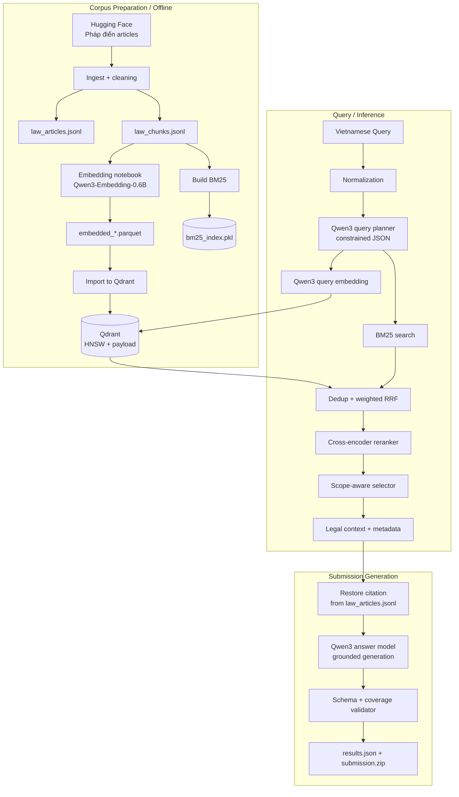
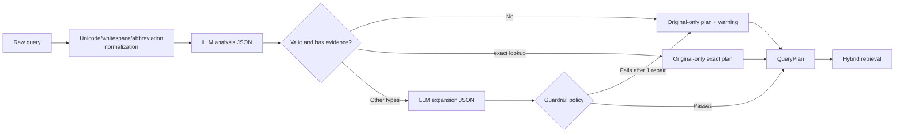
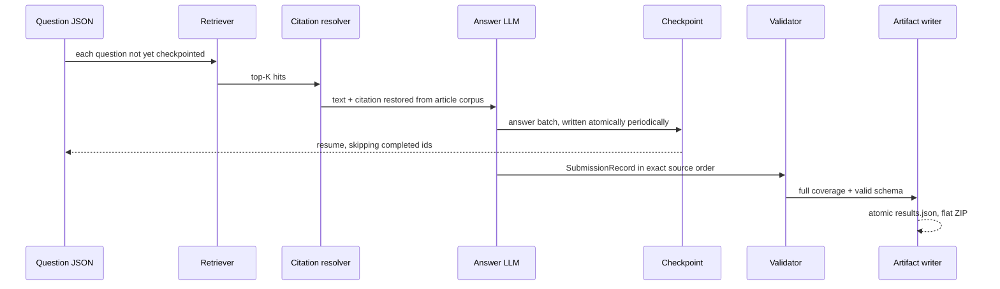

# SME Legal Assistant

A RAG (Retrieval-Augmented Generation) system for retrieving and answering Vietnamese legal questions. The project prepares a corpus from the **Pháp điển** (Vietnam Legal Code), finds legal grounds using hybrid retrieval (dense vector + BM25), can perform controlled query expansion, reranks results, then generates answers based only on the retrieved grounds. In addition to the interactive query mode, the system also has a pipeline for generating `results.json` and `submission.zip` for the Legal QA competition.

> Legal notice: this is a system that assists in searching and synthesizing information; it does not replace legal advice from a lawyer or a competent authority. Answer quality depends directly on the corpus, the index, the model, and the actual retrieval results.

## Table of Contents

- [Scope and Status](#scope-and-status)
- [Architecture](#architecture)
- [End-to-end Data Flow](#end-to-end-data-flow)
- [Query and Ranking Flow](#query-and-ranking-flow)
- [Submission Generation Flow](#submission-generation-flow)
- [Directory Structure](#directory-structure)
- [Installation and Configuration](#installation-and-configuration)
- [Operating the Pipelines](#operating-the-pipelines)
- [Data, Schema and Artifacts](#data-schema-and-artifacts)
- [Retrieval Quality Evaluation](#retrieval-quality-evaluation)
- [Safety, Correctness and Limitations](#safety-correctness-and-limitations)
- [Testing and Troubleshooting](#testing-and-troubleshooting)

## Scope and Status

This repository is a **CLI-driven Python pipeline**. The main entry points are located in `ai_legal_assistant/scripts/`; the core logic uses a domain/application/infrastructure layered architecture.

Currently, the system supports the following capabilities:

- Loading articles from the Hugging Face dataset `tmquan/phapdien-moj-gov-vn` and chunking them according to the Điều/Khoản/Điểm (Article/Clause/Point) structure.
- Generating embeddings using `Qwen/Qwen3-Embedding-0.6B`, saving Parquet shards, and importing them into Qdrant.
- Building and querying a Vietnamese BM25 index, with specialized tokenization for legal terminology and mojibake correction.
- Dense baseline querying or automatic retrieval: query analysis, guardrailed query expansion, dense + BM25 + Weighted RRF + cross-encoder reranking.
- Evaluating Recall@K and MRR@K on a JSONL test set.
- Generating grounded legal answers, extracting citations from the corpus rather than letting the LLM fabricate citations, checkpointing progress, and packaging the submission.

Not yet present in the current source:

- No `FastAPI` application, HTTP routes, web interface, Docker Compose, or user authentication, even though `fastapi` and `uvicorn` are listed in `requirements.txt`.
- No standalone Python script to embed the entire corpus; the embedding process is stored in the Colab notebook `notebooks/colab/Embed_qwen3_06_3b_latest.ipynb`.
- No automatic `.env` loading mechanism (`python-dotenv` is not used). The `.env` file only takes effect if your shell/runner loads it itself.

## Architecture



### Source Code Layers

| Layer | Role | Main Examples |
|---|---|---|
| `domain` | Entities and pure-Python business rules | `LawArticle`, `LawChunk`, `QueryPlan`, chunking, BM25, RRF, selector, validator |
| `application` | Use cases and ports/protocols to decouple logic from technology | ingest, retrieval, query planning, evaluate, generate submission |
| `infrastructure` | Concrete adapters for Hugging Face, Qdrant, SentenceTransformers, Ollama, JSONL, pickle, LLM | `QdrantVectorStore`, `HuggingFaceCausalLLM`, `BM25Search` |
| `scripts` | CLI composition root; wires up config, adapters, and use cases | `query_qdrant.py`, `generate_submission.py` |
| `tests/unit` | Unit tests with fake adapters, no model loading required | query planning, retrieval, BM25, evaluation, submission |

Dependencies point inward: the domain doesn't know about Qdrant or Hugging Face; the application depends on `Protocol`/port abstractions; the infrastructure implements the ports. This makes it possible to swap out Qdrant, the embedding provider, or the LLM with minimal impact on the use cases.

## End-to-end Data Flow

### 1. Ingest the Pháp điển Corpus

Entry point: `python scripts/ingest_phapdien.py`.

`HuggingFacePhapdienLoader` reads the `train` split of the `articles` config from the `tmquan/phapdien-moj-gov-vn` dataset. Each row is:

1. Normalized to Unicode NFC; BOM/NBSP removed; line breaks and whitespace unified.
2. Numeric fields (`subject_number`, `topic_number`) and `source_links` are safely coerced.
3. A stable `article_id` is generated: a 20-character truncated SHA-1 hash derived from `subject_id`, `topic_id`, `article_anchor`, `article_title`, `source_url`.
4. Articles with no `content_text` after cleaning are dropped.
5. Both the original article and its chunks are written simultaneously to UTF-8 JSONL files.

`JsonlLawRepository` opens the file in write mode (`"w"`), so re-running ingest will **overwrite** `data/processed/law_articles.jsonl` and `data/processed/law_chunks.jsonl`. Only run it when you intentionally want to rebuild the corpus.

### 2. Legal Chunking

`LegalChunkingPolicy` preserves legal boundaries as much as possible:

- Splits Khoản (clauses) using line-start markers such as `1. `, `2. `, ...
- Within a Khoản, splits Điểm (points) using markers like `a)`, `b)`, ... when they appear at the start of a sentence/line or after a line break, `;`, or `:`.
- Text where no Khoản can be identified is treated as an Article-level segment.
- A segment no longer than 1,800 characters becomes a single chunk.
- Longer segments are split at priority boundaries: blank line, line break, `. `, `; `, `: `, `, `, then whitespace.
- Sub-chunks are at most 1,800 characters long, with 250-character overlap; tails shorter than 300 characters are merged with the preceding part.

Each `LawChunk` carries contextual metadata such as `article_id`, subject, topic, chapter, article title, clause, point, source URL, character position, `ordinal`, `parent_chunk_id`, and sub-chunk information. `chunk_id` is also a stable hash, but **it is not considered a system-wide unique content identity**, since the current corpus has colliding legacy chunk IDs.

### 3. Embedding Generation and Parquet Sharding

The `notebooks/colab/Embed_qwen3_06_3b_latest.ipynb` notebook is the process used to generate the vector corpus:

- Model: `Qwen/Qwen3-Embedding-0.6B`.
- `max_seq_length=768`.
- Vectors are `float32`, L2-normalized, 1,024 dimensions.
- Each shard contains 5,000 rows (the last shard may contain fewer).
- Each Parquet record includes `point_id`, `vector`, and the full metadata/chunk text payload.

The text fed into embedding includes labeled metadata (Subject, Topic, Chapter, Article, Clause, Point, Source) followed by `Content`. This differs from embedding only the raw `text`: semantic search gets extra legal structural signal. When regenerating vectors, you must use the same text-building method, model, max length, normalization, and payload schema; changing any of these makes the vectors no longer equivalent to the old collection.

The notebook uses UUIDv5 derived from the legacy `chunk_id`. During import, the script regenerates the point ID from the full canonical payload and stores the notebook's ID in `legacy_point_id`. This prevents rows with different content from overwriting each other just because of a colliding legacy ID.

### 4. Import into Qdrant

`scripts/import_parquet_to_qdrant.py` performs the following steps:

1. Sorts `embedded_*.parquet` files, checks that no shard numbers are missing, and verifies both required columns `point_id` and `vector` are present.
2. Checks that every vector has exactly 1,024 dimensions.
3. Creates/checks the Qdrant collection using cosine distance. `--recreate` deletes the old collection before recreating it.
4. Temporarily sets `indexing_threshold=0` so bulk upserts don't continuously rebuild HNSW.
5. Upserts in batches (default 512); failed batches retry with exponential backoff up to 5 times.
6. Creates payload indexes for keyword/integer/boolean fields, then re-enables HNSW with a threshold of 10,000.

Fields that get payload indexes include `chunk_id`, `article_id`, `subject_id`, `topic_id`, clause/point/chunk type/parent; ordinals/numbers; and sub-chunk flags. Retrieval currently doesn't filter using these indexes, but they support audit, filtering, and future API development.

### 5. Build the BM25 Index

`scripts/build_bm25_index.py` reads **directly** from `law_chunks.jsonl`, tokenizes the Vietnamese text, and writes `data/indexes/bm25_index.pkl`.

The tokenizer tries, in order, `underthesea` → `pyvi` → regex (or can be forced via `--tokenizer`). It:

- Normalizes Unicode/whitespace, lowercases, and can fix mojibake.
- Keeps Vietnamese/numeric tokens.
- Adds phrase tokens for legal phrases (e.g. `vốn điều lệ`, `mã số thuế`, `hợp đồng lao động`) with a default `phrase_boost` of 1.
- Stores the tokenizer config alongside the BM25 index, so queries use the same tokenizer used at build time.

BM25 defaults to `k1=1.5`, `b=0.75`; the index stores inverted postings, IDF, document length, text, and metadata. Because the index contains text/metadata, it must be rebuilt every time `law_chunks.jsonl` changes.

### 6. Corpus Sync Audit

`scripts/audit_qdrant_corpus.py` compares `chunk_id`s in the JSONL file against the `chunk_id` payload in Qdrant and exports:

- `missing_in_qdrant.jsonl`: local rows not found in the collection.
- `extra_in_qdrant.jsonl`: chunk IDs found only in the collection.
- `duplicate_chunk_ids_in_qdrant.jsonl`: legacy IDs with multiple points.
- `summary.json`: aggregate statistics.

The audit is based on legacy `chunk_id`, so it's useful for checking coverage but does not replace content-level dedup at runtime. Any report already in the repository is a snapshot artifact at the time of the audit; re-run it after every rebuild/import.

## Query and Ranking Flow

There are two distinct modes that need to be clearly distinguished:

| Mode | Entry Point | Components Run | Purpose |
|---|---|---|---|
| `baseline` | `--retrieval-mode baseline` or evaluation without `--expand-query` | strip query → embedding → Qdrant | Fair, faster dense baseline |
| `auto` | default for `query_qdrant.py` and `generate_submission.py` | normalize → LLM planning → dense + BM25 → RRF → rerank → scope-aware selection | Production/interactive retrieval quality |

### Baseline Dense Retrieval

1. `LegalQuery` trims the query and rejects empty queries.
2. `Qwen3QueryEmbedder` formats the query:

   ```text
   Instruct: Given a Vietnamese legal question, retrieve relevant Vietnamese legal passages that answer the question
   Query:<the question>
   ```

3. SentenceTransformers produces a normalized 1,024-dimensional vector.
4. The use case checks the vector dimension before calling Qdrant.
5. Qdrant `query_points` cosine search returns the top-K payload/text.

This mode does not normalize abbreviations, does not perform query expansion, does not use BM25, and does not use the reranker.

### Auto Retrieval: Safe Query Planning



`VietnameseLegalQueryNormalizer` normalizes NFC/whitespace, expands `TNHH`, `BHXH`, `GTGT`, standardizes the format of `Điều`, `Khoản`, `Điểm`, and legal document numbers such as `123/2020/NĐ-CP`. It must not remove negation words.

`LLMLegalQueryPlanner` uses a separate `Qwen/Qwen3-0.6B` model, distinct from the embedding model. The LLM does not answer legal questions; it only generates JSON constrained by a schema enforced with `lm-format-enforcer`.

The analysis phase extracts:

- `intent`: `deadline`, `penalty`, `procedure`, `definition`, `obligation`, `eligibility`, `unknown`.
- `query_type`: `exact_lookup`, `legal_concept`, `legal_situation`, `multi_issue`, `ambiguous`.
- Domain, entity/must-have terms, business entity type, Article/Clause/document numbers, temporal scope.
- Evidence quotes for each entity/constraint. The quote must appear verbatim in the normalized query.

The expansion phase only runs if the query is not `exact_lookup`, generating semantic variants, scope variants/subqueries, and lexical terms. The selection policy enforces the following conditions:

- The original query always ranks first with weight `1.0`.
- At most three semantic/scope variants and at most two subqueries.
- `exact_lookup` always skips expansion, even if the LLM generates one.
- Semantic variants have weight `0.8`; scope variants `0.7`; subqueries `0.75`.
- No adding of Article/Clause numbers, figures, monetary amounts, deadlines, or time units not present in the query.
- Must not remove `không`, `chưa`, `không phải`, `không được` (negation words).
- Must not change an explicitly stated business entity type.
- BM25 terms must be grounded in the original query or an accepted variant.
- Ambiguous queries need at least two safe scope variants; multi-issue queries need safe subqueries. If not met, the system fails closed to the original-only plan.
- Incorrect JSON or analysis is given one repair attempt. If it's still wrong, the batch doesn't fail: `QueryPlan.warnings` records the reason and retrieval continues with the original query.

`plan_legal_query.py` exports the full `QueryPlan` to allow observation of the analysis, evidence, variants, weights, and warnings before running batch retrieval.

### Hybrid Retrieval, Dedup, and Reranking

For each query in `semantic_queries + subqueries`, the system does the following:

1. Dense search: embed the query using a pipeline compatible with the corpus, then retrieve `per_query_top_k × oversample_factor` raw hits. The default is `20 × 5 = 100` raw hits.
2. Sparse search: query BM25 with the query text plus valid lexical terms not already in the text; also retrieves up to 100 raw hits if BM25 is enabled.
3. Dedup each ranked list by `content_id = SHA-256(v2 | article_id | normalized text)` truncated. The system still collects the legacy `chunk_id`s into metadata for traceability. This handles both legacy chunk ID collisions and points with duplicate content.
4. Keeps at most `per_query_top_k` unique content items for each modality.
5. Fuses dense and BM25 within each query using Weighted Reciprocal Rank Fusion:

   ```text
   RRF(content) = Σ weight_list / (60 + rank)
   ```

   Dense has weight `1.0`, BM25 defaults to `0.7`.
6. Further fuses local rankings across original/variant/subquery using each query's weight.
7. Takes the top `candidate_pool_size` candidates, default 50, while also reserving up to 5 top candidates for each scope branch so scope isn't swallowed by global ranking.
8. If the reranker is enabled, `BAAI/bge-reranker-v2-m3` scores query–document pairs. The query context includes the normalized question, intent, and scope; the document context includes the article title, scope, and text. If the reranker is disabled, the RRF score is the final score.
9. `RetrievalCandidateSelector` sorts by `(rerank_score, rrf_score)`, dedups content, and enforces a limit on chunks per article.

For ambiguous queries, the selector tries to keep one candidate per required scope, limits to one chunk/article by default, and when a reranker is present, only keeps additional candidates that aren't lower than the weakest scope winner by more than `scope_relevance_margin=0.15`. As a result, the system **may return fewer than `top_k`** results; this is intentional behavior to avoid filling the context with weak grounds.

The `auto` CLI results include:

- `query_plan`: original/normalized query, analysis, variants, lexical terms, and warnings.
- `hits`: `chunk_id`, text, final score, corpus metadata.
- Additional metadata: `content_id`, `legacy_chunk_ids`, `matched_scopes`, `rrf_score`, `rerank_score`.

## Submission Generation Flow



Entry point: `python scripts/generate_submission.py`.

1. `JsonCompetitionQuestionSource` reads a JSON array, preserving the question text, requiring `id` to be a unique integer, and requiring non-empty questions.
2. For each question not yet in the checkpoint, the retriever fetches 4 contexts by default. `auto` mode uses the full hybrid pipeline; `baseline` mode uses dense only.
3. `JsonlLegalCitationResolver` loads `law_articles.jsonl` once, parses `source_note_text` to restore the document number/name and article number. If articles from the same document have source notes lacking an excerpt, the resolver uses the longest excerpt already seen from the same document. The LLM is never used to fabricate citations.
4. `SubmissionCitationSelector` chooses the final citations to submit under conservative quotas: exact lookup → 1 article, single-issue question → 2 articles, multi-issue question → up to 5 articles. The answer still receives the entire retrieved context.
5. `GroundedLegalAnswerGenerator` renders the context in retrieval order. Each context is at most 3,000 characters, with a default total of 16,000 characters; headings contain `Điều ..., <document name>` when a citation is present. The system prompt requires answering in Vietnamese, based solely on the context, without fabricating article numbers, deadlines, monetary amounts, or document names.
6. `Qwen/Qwen3-8B` (default) generates answers in batches. On CUDA, `--answer-load-in-4bit` uses NF4/bitsandbytes; this flag is rejected on CPU.
7. After every `--checkpoint-every` new records (default 1), the checkpoint is written atomically. A re-run will validate the checkpoint and only process the ids not yet done. The checkpoint is only deleted after the full artifact has been successfully created.
8. `SubmissionValidator` ensures full coverage of the source question set, no duplicate IDs, question text matches verbatim, non-empty answers, no duplicate citation arrays, and correct pipe-separated format.
9. `SubmissionArtifactWriter` writes `results.json` atomically, creates `submission.zip` containing **only** `results.json` at the root, and self-checks the ZIP structure.

The `results.json` schema is:

```json
[
  {
    "id": 1,
    "question": "The original input question text",
    "answer": "A grounded answer in Vietnamese",
    "relevant_docs": [
      "04/2017/QH14|Law 04/2017/QH14 Law on Support for Small and Medium Enterprises"
    ],
    "relevant_articles": [
      "04/2017/QH14|Law 04/2017/QH14 Law on Support for Small and Medium Enterprises|Article 4"
    ]
  }
]
```

Citations that fail to parse don't cause the answer to fail automatically, so `relevant_docs` and `relevant_articles` can be empty. However, this is a signal that the corpus/source notes need to be audited before using the artifact for anything critical.

## Directory Structure

```text
.
├── README.md
├── notebooks/
│   └── colab/Embed_qwen3_06_3b_latest.ipynb     # generates Parquet embeddings
└── ai_legal_assistant/
    ├── requirements.txt
    ├── data/
    │   ├── raw/                                  # competition questions, source snapshots if any
    │   ├── processed/                            # law_articles.jsonl, law_chunks.jsonl
    │   ├── embeddings/qwen3_06b/                 # embedded_*.parquet
    │   ├── indexes/                              # bm25_index.pkl
    │   ├── eval/                                 # test set and corpus audit
    │   ├── submissions/                          # submission generation output
    │   └── transfer/                             # transfer/snapshot artifacts outside the runtime
    ├── docs/
    │   ├── query-expansion.md
    │   └── retrieval-evaluation.md
    ├── scripts/                                  # CLI entrypoints
    ├── src/ai_legal_assistant/
    │   ├── domain/
    │   ├── application/
    │   └── infrastructure/
    └── tests/unit/
```

`data/` is in `.gitignore`. There may be local data in the current workspace, but a fresh clone should not assume large files, model caches, or a Qdrant collection already exist.

## Installation and Configuration

### Prerequisites

- Python 3.10+ (the code uses `|` type unions, dataclass slots, and modern library APIs).
- Qdrant running, default `http://localhost:6333`.
- Internet/Hugging Face cache access for the first-time download of the dataset and model, or pre-prepared model/dataset caches.
- A CUDA GPU is highly recommended for the planner, reranker, and especially the 8B answer model. CPU works from a code perspective, but the local planner may take several minutes per query.
- Docker is optional, only for running Qdrant locally.

### Setting up the Environment on Windows PowerShell

From the repository root directory:

```powershell
Set-Location .\ai_legal_assistant
python -m venv .venv
.\.venv\Scripts\Activate.ps1
python -m pip install --upgrade pip
python -m pip install -r requirements.txt
```

The scripts automatically add `src/` to `sys.path`, so `pip install -e .` is not needed. If PowerShell blocks the activation script, apply the policy only to the current process:

```powershell
Set-ExecutionPolicy -Scope Process -ExecutionPolicy Bypass
.\.venv\Scripts\Activate.ps1
```

### Running Qdrant Locally with Docker

The following example creates persistent storage inside the project's data directory:

```powershell
docker run --name qdrant-law --rm `
  -p 6333:6333 -p 6334:6334 `
  -v "${PWD}\data\vectorstores\qdrant:/qdrant/storage" `
  qdrant/qdrant
```

Do not use `--rm` if you want the container to persist after being stopped. Port 6333 is the HTTP API; port 6334 is gRPC. If using Qdrant Cloud, just change the URL/API key; no local Docker run is needed.

### Environment Variables

Scripts read the environment using `os.getenv`; they do not parse `.env` automatically. In PowerShell, set these for the current session as follows:

```powershell
$env:QDRANT_URL = "http://localhost:6333"
$env:QDRANT_COLLECTION = "law_chunks_qwen3_06b"
$env:QDRANT_API_KEY = ""                 # only set when using Qdrant with an API key
$env:EMBEDDING_PROVIDER = "huggingface"  # or ollama
$env:EMBEDDING_MODEL = "Qwen/Qwen3-Embedding-0.6B"
$env:QUERY_PLANNER_MODEL = "Qwen/Qwen3-0.6B"
$env:RERANKER_MODEL = "BAAI/bge-reranker-v2-m3"
$env:ANSWER_MODEL = "Qwen/Qwen3-8B"
```

| Variable | Used In | Default Value / Meaning |
|---|---|---|
| `QDRANT_URL` | retrieval, import, audit, submission | `http://localhost:6333` |
| `QDRANT_COLLECTION` | retrieval, import, audit, submission | `law_chunks_qwen3_06b` |
| `QDRANT_API_KEY` | Qdrant client | optional |
| `EMBEDDING_PROVIDER` | retrieval/submission/evaluation | `huggingface` or `ollama` |
| `EMBEDDING_MODEL` | embedder | `Qwen/Qwen3-Embedding-0.6B` |
| `EMBEDDING_DEVICE` | submission script only | e.g. `cuda`, `cuda:0`, `cpu` |
| `OLLAMA_URL` | Ollama embedder | `http://localhost:11434` |
| `QUERY_EMBEDDING_INSTRUCTION` | query embedding format | default retrieval instruction in code |
| `QUERY_PLANNER_MODEL`, `QUERY_PLANNER_DEVICE` | auto planning | `Qwen/Qwen3-0.6B`, auto-selected device |
| `RERANKER_MODEL`, `RERANKER_DEVICE` | cross encoder | `BAAI/bge-reranker-v2-m3` |
| `ANSWER_MODEL`, `ANSWER_DEVICE` | submission answer model | `Qwen/Qwen3-8B`, auto-selected device |

With `EMBEDDING_PROVIDER=ollama`, the model/query formatting must be compatible with the already-embedded collection. Do not evaluate a Qwen3 SentenceTransformers collection with an Ollama adapter unless you know they produce equivalent vectors; the benchmark quality will no longer be meaningful.

## Operating the Pipelines

The commands below are all run from `ai_legal_assistant/` after activating the virtual environment.

### A. Rebuilding the Corpus from Scratch

#### 1. Ingest

```powershell
python scripts/ingest_phapdien.py
```

Output:

- `data/processed/law_articles.jsonl`
- `data/processed/law_chunks.jsonl`

The command currently does not expose `--limit` or `--output-dir` on the CLI; the use case supports them, but the script uses the defaults. For small-scale testing, call the use case from Python or add the flag deliberately.

#### 2. Generate Parquet Embeddings

Open the notebook `notebooks/colab/Embed_qwen3_06_3b_latest.ipynb` in Colab/Jupyter, adjust `BASE_DIR`, `CHUNKS_PATH`, `OUT_DIR`, `START_SHARD`, `END_SHARD` to fit your storage, then run the embedding cells. The goal is to have a continuous sequence:

```text
data/embeddings/qwen3_06b/embedded_000.parquet
data/embeddings/qwen3_06b/embedded_001.parquet
...
```

The notebook has file-based checkpointing: existing shards are skipped. However, you should not combine shards created from different corpus/model/payload schemas.

#### 3. Import into Qdrant

```powershell
python scripts/import_parquet_to_qdrant.py `
  --input-dir data/embeddings/qwen3_06b `
  --collection law_chunks_qwen3_06b `
  --recreate
```

`--recreate` is a destructive operation on the target collection. Omit this flag when you want to continue importing into an existing valid collection. When resuming from a particular shard, use `--start-file <n>`; you need to be sure the earlier shards have already been imported with the same collection/payload.

#### 4. Build BM25 from the Same Corpus

```powershell
python scripts/build_bm25_index.py `
  --chunks-path data/processed/law_chunks.jsonl `
  --output-path data/indexes/bm25_index.pkl
```

Example of forcing the regex tokenizer to reproduce results in an environment without a Vietnamese tokenizer:

```powershell
python scripts/build_bm25_index.py --tokenizer regex
```

#### 5. Coverage Audit

```powershell
python scripts/audit_qdrant_corpus.py `
  --chunks-path data/processed/law_chunks.jsonl `
  --collection law_chunks_qwen3_06b
```

Do not proceed to benchmarking/submission if `missing_in_qdrant` is not zero, unless you have a precise understanding of why (e.g. the collection intentionally contains only a subset).

### B. Viewing the Query Plan Before Querying

```powershell
python scripts/plan_legal_query.py `
  "Thời hạn góp đủ vốn điều lệ là bao lâu?" `
  --planner-model "Qwen/Qwen3-0.6B"
```

Check the `warnings`, evidence, `query_type`, variants, and lexical terms. An original-only plan with a warning is a safe degradation, not a legal answer.

### C. Interactive Querying

Auto mode (default; enables query planning, BM25, and reranker):

```powershell
python scripts/query_qdrant.py `
  "Thời hạn góp đủ vốn điều lệ là bao lâu?" `
  --top-k 5 `
  --per-query-top-k 20
```

Dense-only baseline, useful for A/B testing:

```powershell
python scripts/query_qdrant.py `
  "Thời hạn góp đủ vốn điều lệ là bao lâu?" `
  --retrieval-mode baseline `
  --top-k 5
```

Auto mode with individual stages disabled for analysis:

```powershell
# still planning, but dense-only, no BM25 and no reranking
python scripts/query_qdrant.py "Legal question" `
  --disable-bm25 `
  --disable-reranker
```

Notable retrieval knobs:

| Flag | Default | Meaning |
|---|---:|---|
| `--top-k` | 10 | maximum number of final hits |
| `--per-query-top-k` | 20 | unique content kept per query after dedup |
| `--oversample-factor` | 5 | factor for raw hits fetched before dedup |
| `--bm25-weight` | 0.7 | weight of the sparse list in local RRF |
| `--candidate-pool-size` | 50 | pool size before reranking |
| `--scope-candidates-per-branch` | 5 | reserved candidates per scope |
| `--max-chunks-per-article` | 2 | article cap for normal queries |
| `--ambiguous-max-chunks-per-article` | 1 | article cap for ambiguous queries |
| `--scope-relevance-margin` | 0.15 | threshold for weak candidates after the scope winner |

### D. Generating the Competition Artifact

Example with a CUDA GPU, small batch, with checkpointing:

```powershell
python scripts/generate_submission.py `
  --questions "data/raw/R2AIStage1DATA (1).json" `
  --articles data/processed/law_articles.jsonl `
  --output-dir data/submissions/private_candidate `
  --embedding-device cuda `
  --planner-device cuda `
  --reranker-device cuda `
  --answer-device cuda `
  --answer-load-in-4bit `
  --answer-batch-size 2 `
  --checkpoint-every 1
```

To run the dense baseline for comparison:

```powershell
python scripts/generate_submission.py `
  --retrieval-mode baseline `
  --output-dir data/submissions/baseline
```

The output produced is:

```text
data/submissions/<output-name>/results.json
data/submissions/<output-name>/submission.zip
```

Validate before uploading to the quota:

```powershell
python scripts/validate_submission.py `
  data/submissions/private_candidate/results.json `
  --questions "data/raw/R2AIStage1DATA (1).json" `
  --zip data/submissions/private_candidate/submission.zip
```

If local gold labels are available, measure macro Precision/Recall/F2 for citations before submitting:

```powershell
python scripts/evaluate_submission.py `
  data/submissions/private_candidate/results.json `
  --gold data/eval/submission_gold.json
```

### E. Importing an Existing Snapshot/Transfer

The `data/transfer/` directory is only a transfer/snapshot artifact, not a direct input for the scripts. If restoring Qdrant from a snapshot, follow the restore mechanism appropriate for your Qdrant version, and afterward run `audit_qdrant_corpus.py`; do not treat a snapshot as proof that the collection is compatible with the current corpus.

## Data, Schema and Artifacts

### `law_articles.jsonl`

Each line is a `LawArticle`, including `article_id`, subject/topic/chapter/article metadata, source note/link/URL, `text`, `char_len`, `word_count`. This is the authoritative source in the project used by the citation resolver to cross-reference `article_id` and retrieve `source_note_text`.

### `law_chunks.jsonl`

Each line is a `LawChunk` with the following core fields:

```json
{
  "chunk_id": "...",
  "article_id": "...",
  "article_title": "...",
  "clause_number": "...",
  "point_label": "...",
  "chunk_type": "article|clause|point|*_part",
  "text": "...",
  "ordinal": 1,
  "parent_chunk_id": null,
  "is_subchunk": false,
  "start_char": 0,
  "end_char": 123
}
```

### Embedding Parquet

Each `embedded_*.parquet` file must contain `point_id` and `vector`. The remaining metadata/payload columns pass through to Qdrant, including `text`, `chunk_id`, `article_id`, and legal context. The import script rejects vectors that don't have exactly 1,024 elements.

### BM25 Pickle

`bm25_index.pkl` is an internal Python pickle, not a safe format to accept from untrusted sources. Only load an index generated by your own pipeline or an artifact you trust. The payload contains a `BM25Index` and tokenizer config so queries are tokenized consistently.

### Retrieval Test Set

`data/eval/retrieval_testset.jsonl` uses one JSON object per line. Each case must select **exactly one** relevance level:

```json
{"id":"capital-001","query":"Thời hạn góp đủ vốn điều lệ là bao lâu?","relevant_chunk_ids":["chunk-id"]}
{"id":"tax-001","query":"Khi nào phải đăng ký mã số thuế?","relevant_article_ids":["article-id"]}
```

Do not use `relevant_chunk_ids` and `relevant_article_ids` simultaneously in a single case. Chunk-level measures passage retrieval more strictly; article-level is appropriate when multiple Khoản/Điểm within the same Article are all acceptable.

## Retrieval Quality Evaluation

Run the dense baseline:

```powershell
python scripts/evaluate_retrieval.py `
  --cutoffs 1,3,5,10,20 `
  --embedding-provider huggingface `
  --model "Qwen/Qwen3-Embedding-0.6B"
```

Evaluate expansion + dense (without BM25/reranker):

```powershell
python scripts/evaluate_retrieval.py `
  --cutoffs 1,3,5,10,20 `
  --expand-query `
  --per-query-top-k 20
```

Evaluate full hybrid:

```powershell
python scripts/evaluate_retrieval.py `
  --cutoffs 1,3,5,10,20 `
  --expand-query `
  --use-bm25 `
  --use-reranker `
  --per-query-top-k 20
```

The evaluator runs each case up to `max(cutoffs)`, then macro-averages across cases:

- `Recall@K = |unique(retrieved[:K]) ∩ relevant| / |relevant|`.
- `MRR@K = 1 / rank` of the first relevant hit within the top K, or `0` if there is none.

When a case uses a chunk label, the evaluator compares against `hit.chunk_id`; when it uses an article label, it compares against `hit.metadata["article_id"]`. Report at least three runs on the **same test set**: dense baseline, expanded/hybrid without reranking, and full hybrid + reranking. Do not conclude that query expansion is good/bad based on a single example.

## Safety, Correctness and Limitations

### Existing Guardrails

- The planner JSON is schema-constrained at generation time and re-validated in Python.
- Analysis evidence must be a quote that appears in the query; fabricated evidence causes the plan to fall back to original-only.
- Expansion must not fabricate numbers, durations, negations, or business entity types.
- Planner/expansion errors only degrade a single query; they do not stop the entire submission batch.
- Citations are derived from the corpus JSONL, not taken directly from the answer model.
- Submissions are validated for coverage/schema and written atomically; the ZIP is required to contain only `results.json` at the root.
- Vector dimensions, Parquet input, shard continuity, BM25 parameters, and positive retrieval configuration are all validated.

### What the Guardrails Do NOT Guarantee

- Retrieval can pull the wrong grounds; the answer model may still interpret them imperfectly even within the provided context.
- The citation resolver is a regex over `source_note_text`; source metadata that doesn't follow the pattern will have no citation.
- The local 0.6B planner may generate weak/malformed expansions. The code fails closed, but an original-only retrieval does not mean the answer is always correct.
- The source dataset, embedding corpus, Qdrant collection, and BM25 index can drift out of sync if not operated as a bundle.
- The system does not yet have a version registry/model registry, telemetry, access control, rate limiting, API server, or human review workflow.

### Important Operational Invariants

1. `law_chunks.jsonl`, the Parquet files, the Qdrant collection, and the BM25 index must all be the same corpus version.
2. The query embedder must be compatible with the model/instruction/max length/normalization used when embedding the corpus.
3. Do not use `--recreate` on a collection in active service without a backup/approval.
4. Do not load an unfamiliar `.pkl` file; pickle can execute code upon deserialization.
5. Keep answer batches small and monitor VRAM; increasing the batch size does not automatically make inference better.
6. For real-world legal use cases, add expert review, controlled PII logging, tiered evaluation, and a mechanism for updating legal document validity.

## Testing and Troubleshooting

### Unit Tests

```powershell
Set-Location .\ai_legal_assistant
python -m unittest discover -s tests -p "test_*.py"
```

Tests do not require a real Qdrant instance or real model loading: they use fake embedders/vector stores/planners/rerankers/LLMs. Areas currently covered include normalization/guardrail planning, content dedup + fusion + scope selection, BM25/tokenizer, metrics, citation resolution, checkpointing, validator, and flat ZIP structure.

### Common Issues

| Symptom | Possible Cause | Resolution |
|---|---|---|
| Cannot connect to Qdrant | service not running or wrong `QDRANT_URL` | check the container/service, URL, network, and API key |
| `dimension ... expects 1024` | collection/embedding model configuration mismatch | use the correct model/corpus pair or create a new collection with the correct dimension |
| `No embedded_*.parquet files found` | wrong path or notebook not yet run | check `--input-dir`, generate a continuous shard sequence |
| `Missing Parquet shards` | a shard is missing | regenerate/copy the missing shard, do not import an incomplete corpus |
| BM25 index not found or file error | index not yet built/from a different corpus | rebuild using the current `law_chunks.jsonl` |
| Planner very slow on CPU | Qwen generation running locally on CPU | use CUDA, a model server, or the baseline to benchmark retrieval |
| Plan only contains original query + warning | JSON/evidence/expansion did not pass the guardrail | inspect using `plan_legal_query.py`; this is the expected fail-closed behavior |
| Submission resume fails | checkpoint doesn't match the question source or is malformed | keep the source question file unchanged; only fix/delete the checkpoint after verifying the IDs |
| Citation arrays are empty | `source_note_text` could not be parsed | audit the JSONL source notes, improve the resolver/pattern before uploading |
| Out-of-memory answer model | 8B model/context/batch too large | use CUDA, `--answer-load-in-4bit`, reduce batch/context, or use a smaller already-evaluated model |

## Related Documentation

- [Query expansion](ai_legal_assistant/docs/query-expansion.md): planning rules, hybrid fusion, and A/B retrieval.
- [Retrieval evaluation](ai_legal_assistant/docs/retrieval-evaluation.md): test set and how to read Recall/MRR.

These documents supplement the README with further detail; the README is the starting point for operating the entire flow from corpus to final artifact.

