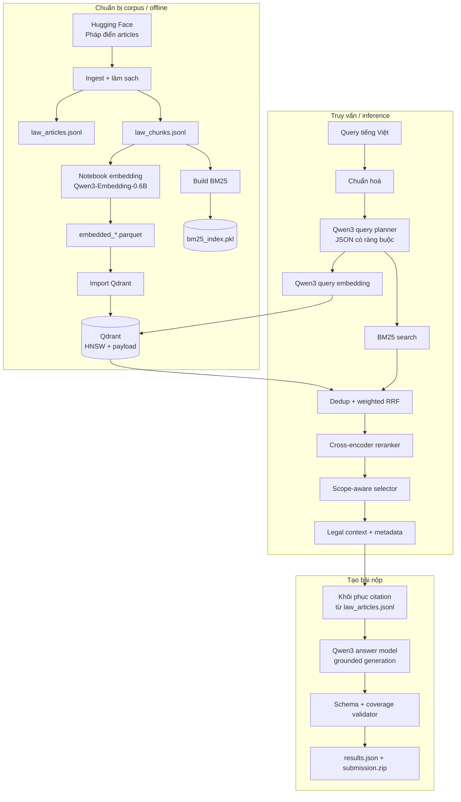
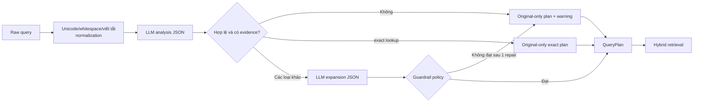
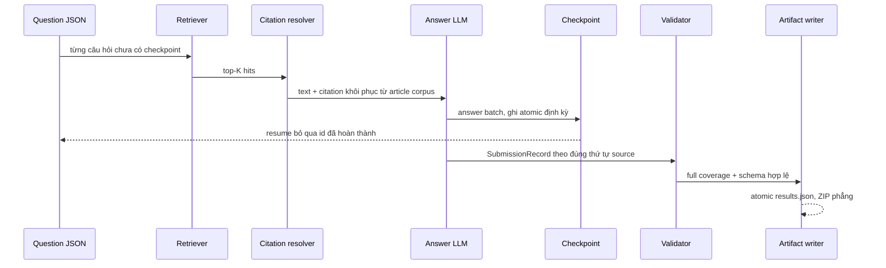

# SME Legal Assistant

Hệ thống RAG (Retrieval-Augmented Generation) phục vụ truy xuất và trả lời câu hỏi pháp lý Việt Nam. Dự án chuẩn bị corpus từ **Pháp điển**, tìm căn cứ bằng hybrid retrieval (dense vector + BM25), có thể mở rộng truy vấn một cách kiểm soát, rerank kết quả, rồi sinh câu trả lời chỉ dựa trên các căn cứ đã lấy được. Ngoài chế độ truy vấn tương tác, hệ thống còn có pipeline tạo `results.json` và `submission.zip` cho bài thi Legal QA.

> Lưu ý pháp lý: đây là hệ thống hỗ trợ tìm và tổng hợp thông tin, không thay thế tư vấn pháp lý của luật sư hoặc cơ quan có thẩm quyền. Chất lượng câu trả lời phụ thuộc trực tiếp vào corpus, chỉ mục, mô hình và các kết quả truy xuất thực tế.

## Mục lục

- [Phạm vi và trạng thái](#phạm-vi-và-trạng-thái)
- [Kiến trúc](#kiến-trúc)
- [Luồng dữ liệu end-to-end](#luồng-dữ-liệu-end-to-end)
- [Luồng truy vấn và xếp hạng](#luồng-truy-vấn-và-xếp-hạng)
- [Luồng tạo bài nộp](#luồng-tạo-bài-nộp)
- [Cấu trúc thư mục](#cấu-trúc-thư-mục)
- [Cài đặt và cấu hình](#cài-đặt-và-cấu-hình)
- [Vận hành các pipeline](#vận-hành-các-pipeline)
- [Dữ liệu, schema và artifact](#dữ-liệu-schema-và-artifact)
- [Đánh giá chất lượng retrieval](#đánh-giá-chất-lượng-retrieval)
- [An toàn, tính đúng đắn và giới hạn](#an-toàn-tính-đúng-đắn-và-giới-hạn)
- [Kiểm thử và xử lý sự cố](#kiểm-thử-và-xử-lý-sự-cố)

## Phạm vi và trạng thái

Repository này là một **pipeline Python chạy bằng CLI**. Điểm vào chính nằm trong `ai_legal_assistant/scripts/`; phần logic lõi dùng kiến trúc phân lớp domain/application/infrastructure.

Hiện tại có các khả năng sau:

- Nạp articles từ Hugging Face dataset `tmquan/phapdien-moj-gov-vn` và chunk theo cấu trúc Điều/Khoản/Điểm.
- Tạo embedding bằng `Qwen/Qwen3-Embedding-0.6B`, lưu shard Parquet và import vào Qdrant.
- Tạo và truy vấn BM25 tiếng Việt, có tokenize chuyên biệt cho thuật ngữ pháp lý và sửa mojibake.
- Truy vấn dense baseline hoặc retrieval tự động: phân tích query, query expansion có guardrail, dense + BM25 + Weighted RRF + cross-encoder reranking.
- Đánh giá Recall@K và MRR@K trên test set JSONL.
- Sinh câu trả lời pháp lý grounded, trích citation từ corpus thay vì để LLM tự bịa citation, checkpoint tiến trình và đóng gói bài nộp.

Chưa có trong source hiện tại:

- Không có `FastAPI` application, route HTTP, giao diện web, Docker Compose hay xác thực người dùng, dù `fastapi` và `uvicorn` có trong `requirements.txt`.
- Không có script Python độc lập để embed toàn bộ corpus; quy trình embedding được lưu trong notebook Colab `notebooks/colab/Embed_qwen3_06_3b_latest.ipynb`.
- Không có cơ chế tự động nạp `.env` (`python-dotenv` không được dùng). File `.env` chỉ có tác dụng nếu shell/runner của bạn tự nạp nó.

## Kiến trúc



### Phân lớp mã nguồn

| Lớp | Vai trò | Ví dụ chính |
|---|---|---|
| `domain` | Entity và quy tắc nghiệp vụ thuần Python | `LawArticle`, `LawChunk`, `QueryPlan`, chunking, BM25, RRF, selector, validator |
| `application` | Use case và port/protocol để tách logic khỏi công nghệ | ingest, retrieval, query planning, evaluate, generate submission |
| `infrastructure` | Adapter cụ thể cho Hugging Face, Qdrant, SentenceTransformers, Ollama, JSONL, pickle, LLM | `QdrantVectorStore`, `HuggingFaceCausalLLM`, `BM25Search` |
| `scripts` | CLI composition root; ghép config, adapter và use case | `query_qdrant.py`, `generate_submission.py` |
| `tests/unit` | Unit test với fake adapter, không cần tải model | query planning, retrieval, BM25, evaluation, submission |

Dependency hướng vào trong: domain không biết Qdrant hay Hugging Face; application phụ thuộc vào các `Protocol`/port; infrastructure hiện thực port. Vì vậy có thể thay Qdrant, embedding provider hoặc LLM mà ít ảnh hưởng use case.

## Luồng dữ liệu end-to-end

### 1. Ingest corpus Pháp điển

Điểm vào: `python scripts/ingest_phapdien.py`.

`HuggingFacePhapdienLoader` đọc split `train` của config `articles` từ dataset `tmquan/phapdien-moj-gov-vn`. Mỗi row được:

1. Chuẩn hoá Unicode về NFC; bỏ BOM/NBSP; thống nhất xuống dòng và khoảng trắng.
2. Ép an toàn các trường số (`subject_number`, `topic_number`) và `source_links`.
3. Tạo `article_id` ổn định: SHA-1 rút gọn 20 ký tự từ `subject_id`, `topic_id`, `article_anchor`, `article_title`, `source_url`.
4. Bỏ article không có `content_text` sau làm sạch.
5. Ghi đồng thời article gốc và các chunk ra JSONL UTF-8.

`JsonlLawRepository` mở file ở chế độ ghi mới (`"w"`), vì thế chạy ingest lại sẽ **ghi đè** `data/processed/law_articles.jsonl` và `data/processed/law_chunks.jsonl`. Chỉ chạy khi chủ động tái tạo corpus.

### 2. Chunking pháp lý

`LegalChunkingPolicy` giữ được ranh giới pháp lý càng nhiều càng tốt:

- Tách Khoản bằng marker đầu dòng dạng `1. `, `2. `, ...
- Bên trong Khoản tách Điểm bằng marker `a)`, `b)`, ... khi xuất hiện ở đầu câu/đầu dòng hoặc sau xuống dòng, `;`, `:`.
- Đoạn không nhận diện được Khoản được coi là segment cấp Article.
- Một segment không quá 1.800 ký tự trở thành một chunk.
- Segment dài hơn được tách tại ranh giới ưu tiên: đoạn trống, xuống dòng, `. `, `; `, `: `, `, `, rồi khoảng trắng.
- Chunk con dài tối đa 1.800 ký tự, overlap 250 ký tự; tail ngắn dưới 300 ký tự được gộp với phần trước.

Mỗi `LawChunk` mang cả metadata ngữ cảnh như `article_id`, chủ đề, đề mục, chương, tên Điều, Khoản, Điểm, URL nguồn, vị trí ký tự, `ordinal`, `parent_chunk_id` và thông tin subchunk. `chunk_id` cũng là hash ổn định, nhưng **không được coi là identity duy nhất của nội dung toàn hệ thống**, vì corpus hiện có legacy chunk ID trùng nhau.

### 3. Tạo embedding và shard Parquet

Notebook `notebooks/colab/Embed_qwen3_06_3b_latest.ipynb` là quy trình đã dùng để tạo corpus vector:

- Model: `Qwen/Qwen3-Embedding-0.6B`.
- `max_seq_length=768`.
- Vector `float32`, L2-normalized, 1.024 chiều.
- Mỗi shard chứa 5.000 row (shard cuối có thể ít hơn).
- Mỗi record Parquet gồm `point_id`, `vector` và toàn bộ payload metadata/chunk text.

Văn bản đưa vào embedding gồm metadata có nhãn (Chủ đề, Đề mục, Chương, Điều, Khoản, Điểm, Nguồn) rồi đến `Nội dung`. Điều này khác với chỉ embed raw `text`: semantic search có thêm tín hiệu cấu trúc pháp lý. Khi tái tạo vector, cần dùng cùng cách build text, model, max length, normalize và payload schema; thay đổi một trong các phần này làm vector không còn tương đương với collection cũ.

Notebook dùng UUIDv5 từ legacy `chunk_id`. Khi import, script lại sinh point ID từ toàn payload canonical và lưu ID notebook trong `legacy_point_id`. Cách này ngăn row khác nội dung bị ghi đè chỉ vì trùng legacy ID.

### 4. Import Qdrant

`scripts/import_parquet_to_qdrant.py` thực hiện các bước:

1. Sắp xếp `embedded_*.parquet`, kiểm tra không thiếu số shard và có cả hai cột bắt buộc `point_id`, `vector`.
2. Kiểm tra mọi vector có đúng 1.024 chiều.
3. Tạo/kiểm tra collection Qdrant dùng cosine distance. `--recreate` xoá collection cũ trước khi tạo lại.
4. Tạm đặt `indexing_threshold=0` để bulk upsert không xây HNSW liên tục.
5. Upsert theo batch (mặc định 512); lỗi batch retry exponential backoff tối đa 5 lần.
6. Tạo payload index cho các trường keyword/integer/boolean, rồi bật lại HNSW với threshold 10.000.

Các field được tạo payload index gồm `chunk_id`, `article_id`, `subject_id`, `topic_id`, Khoản/Điểm/loại chunk/parent; các ordinal/number; và cờ subchunk. Retrieval hiện không filter bằng các index này, nhưng chúng hỗ trợ audit, filter và phát triển API sau này.

### 5. Build chỉ mục BM25

`scripts/build_bm25_index.py` đọc **chính** `law_chunks.jsonl`, token hoá tiếng Việt và ghi `data/indexes/bm25_index.pkl`.

Tokenizer thử theo thứ tự `underthesea` → `pyvi` → regex (hoặc ép bằng `--tokenizer`). Nó:

- Chuẩn hoá Unicode/khoảng trắng, lowercase và có thể sửa mojibake.
- Giữ token tiếng Việt/số.
- Thêm token phrase cho các cụm pháp lý (ví dụ `vốn điều lệ`, `mã số thuế`, `hợp đồng lao động`) với `phrase_boost` mặc định 1.
- Lưu config tokenizer ngay cạnh BM25 index, để query dùng đúng tokenizer đã dùng lúc build.

BM25 mặc định `k1=1.5`, `b=0.75`; index lưu inverted postings, IDF, document length, text và metadata. Vì index chứa text/metadata, nó phải được rebuild mỗi khi `law_chunks.jsonl` thay đổi.

### 6. Audit đồng bộ corpus

`scripts/audit_qdrant_corpus.py` so sánh `chunk_id` ở JSONL với payload `chunk_id` trong Qdrant và xuất:

- `missing_in_qdrant.jsonl`: row local chưa thấy trong collection.
- `extra_in_qdrant.jsonl`: chunk ID chỉ có ở collection.
- `duplicate_chunk_ids_in_qdrant.jsonl`: legacy ID có nhiều point.
- `summary.json`: số liệu tổng hợp.

Audit theo legacy `chunk_id`, nên hữu ích để kiểm tra coverage nhưng không thay thế content-level dedup ở runtime. Báo cáo có sẵn trong repository là artifact tại thời điểm audit; hãy chạy lại sau mỗi lần rebuild/import.

## Luồng truy vấn và xếp hạng

Có hai mode khác nhau, cần phân biệt rõ:

| Mode | Điểm vào | Thành phần chạy | Mục đích |
|---|---|---|---|
| `baseline` | `--retrieval-mode baseline` hoặc evaluation không có `--expand-query` | strip query → embedding → Qdrant | Baseline dense công bằng, nhanh hơn |
| `auto` | mặc định của `query_qdrant.py` và `generate_submission.py` | normalize → LLM planning → dense + BM25 → RRF → rerank → scope-aware selection | Chất lượng retrieval production/interactive |

### Baseline dense retrieval

1. `LegalQuery` trim query và từ chối query rỗng.
2. `Qwen3QueryEmbedder` format query:

   ```text
   Instruct: Given a Vietnamese legal question, retrieve relevant Vietnamese legal passages that answer the question
   Query:<câu hỏi>
   ```

3. SentenceTransformers tạo vector normalized 1.024 chiều.
4. Use case kiểm tra vector dimension trước khi gọi Qdrant.
5. Qdrant `query_points` cosine trả về top-K payload/text.

Mode này không chuẩn hoá viết tắt, không query expansion, không BM25, không reranker.

### Auto retrieval: kế hoạch query an toàn



`VietnameseLegalQueryNormalizer` chuẩn hoá NFC/khoảng trắng, mở rộng `TNHH`, `BHXH`, `GTGT`, chuẩn hoá định dạng `Điều`, `Khoản`, `Điểm` và số hiệu văn bản dạng `123/2020/NĐ-CP`. Nó không được phép làm mất phủ định.

`LLMLegalQueryPlanner` dùng `Qwen/Qwen3-0.6B` riêng với embedding model. LLM không trả lời câu hỏi pháp luật; nó chỉ tạo JSON có schema bị ràng buộc bằng `lm-format-enforcer`.

Pha analysis trích:

- `intent`: `deadline`, `penalty`, `procedure`, `definition`, `obligation`, `eligibility`, `unknown`.
- `query_type`: `exact_lookup`, `legal_concept`, `legal_situation`, `multi_issue`, `ambiguous`.
- domain, entity/must term, loại hình doanh nghiệp, số Điều/Khoản/văn bản, temporal scope.
- evidence quote cho từng entity/constraint. Quote phải xuất hiện nguyên nghĩa trong query đã chuẩn hoá.

Pha expansion chỉ chạy nếu không phải `exact_lookup`, tạo semantic variant, scope variant/subquery và lexical term. Chính sách selection áp các điều kiện sau:

- Original query luôn đứng đầu với weight `1.0`.
- Tối đa ba semantic/scope variant và tối đa hai subquery.
- `exact_lookup` luôn bỏ expansion, kể cả LLM có sinh ra.
- Variant semantic có weight `0.8`; scope variant `0.7`; subquery `0.75`.
- Không thêm số Điều/Khoản, con số, số tiền, thời hạn hoặc đơn vị thời gian không có trong query.
- Không được làm mất `không`, `chưa`, `không phải`, `không được`.
- Không đổi loại hình doanh nghiệp đã nêu rõ.
- Term BM25 phải grounded trong query gốc hoặc variant đã được nhận.
- Ambiguous query cần ít nhất hai scope variant an toàn; multi-issue cần subquery an toàn. Nếu không đạt, hệ thống fail closed về original-only plan.
- JSON hoặc analysis sai được cho một lần repair. Nếu vẫn sai, batch không chết: `QueryPlan.warnings` ghi lý do và retrieval tiếp tục với query gốc.

`plan_legal_query.py` xuất toàn bộ `QueryPlan` để quan sát analysis, evidence, variant, weight và warning trước khi chạy retrieval hàng loạt.

### Hybrid retrieval, dedup và rerank

Với từng query trong `semantic_queries + subqueries`, hệ thống làm như sau:

1. Dense search: embed query bằng pipeline tương thích corpus rồi lấy `per_query_top_k × oversample_factor` hit. Mặc định là `20 × 5 = 100` hit thô.
2. Sparse search: query BM25 với query text cộng lexical term hợp lệ chưa có trong text; cũng lấy 100 hit thô nếu BM25 bật.
3. Dedup từng ranked list theo `content_id = SHA-256(v2 | article_id | normalized text)` rút gọn. Hệ thống vẫn gom các legacy `chunk_id` vào metadata để trace được nguồn. Điều này xử lý cả legacy chunk ID va chạm và point trùng nội dung.
4. Giữ tối đa `per_query_top_k` content duy nhất cho mỗi modality.
5. Fuse dense và BM25 trong từng query bằng Weighted Reciprocal Rank Fusion:

   ```text
   RRF(content) = Σ weight_list / (60 + rank)
   ```

   Dense có weight `1.0`, BM25 mặc định `0.7`.
6. Fuse tiếp các local ranking giữa original/variant/subquery bằng weight của từng query.
7. Lấy `candidate_pool_size` mặc định 50 candidate tốt nhất, đồng thời reserve thêm tối đa 5 candidate đầu cho mỗi scope branch để scope không bị global ranking nuốt mất.
8. Nếu bật reranker, `BAAI/bge-reranker-v2-m3` chấm query–document pair. Query context có câu hỏi chuẩn hoá, intent và scope; document context có tên Điều, scope và text. Nếu tắt reranker, RRF score là final score.
9. `RetrievalCandidateSelector` sort theo `(rerank_score, rrf_score)`, dedup content, áp giới hạn chunk trên mỗi article.

Với ambiguous query, selector cố giữ một candidate cho mỗi scope bắt buộc, giới hạn một chunk/article mặc định, và khi có reranker chỉ giữ candidate bổ sung không thấp hơn scope winner yếu nhất quá `scope_relevance_margin=0.15`. Vì vậy hệ thống **có thể trả ít hơn `top_k`**; đây là hành vi chủ động để tránh lấp context bằng căn cứ yếu.

Kết quả CLI `auto` có:

- `query_plan`: original/normalized query, analysis, variant, lexical term và warnings.
- `hits`: `chunk_id`, text, final score, metadata corpus.
- Metadata bổ sung: `content_id`, `legacy_chunk_ids`, `matched_scopes`, `rrf_score`, `rerank_score`.

## Luồng tạo bài nộp



Điểm vào: `python scripts/generate_submission.py`.

1. `JsonCompetitionQuestionSource` đọc JSON array, giữ nguyên question text, yêu cầu `id` là integer duy nhất và câu hỏi không rỗng.
2. Với mỗi question chưa có trong checkpoint, retriever lấy mặc định 8 context. Mode `auto` dùng full hybrid pipeline; mode `baseline` chỉ dense.
3. `JsonlLegalCitationResolver` load `law_articles.jsonl` một lần, parse `source_note_text` để khôi phục số/tên văn bản và số Điều. Nếu các article cùng một văn bản có source note thiếu trích yếu, resolver dùng trích yếu dài nhất của cùng document đã thấy. LLM không được dùng để bịa citation.
4. `GroundedLegalAnswerGenerator` render context theo thứ tự retrieval. Mỗi context tối đa 3.000 ký tự và tổng mặc định 16.000 ký tự; heading chứa `Điều ..., <tên văn bản>` khi citation có mặt. System prompt bắt buộc trả lời tiếng Việt chỉ dựa trên context, không bịa số Điều/thời hạn/mức tiền/tên văn bản.
5. `Qwen/Qwen3-8B` (mặc định) sinh answer batch. Với CUDA, `--answer-load-in-4bit` dùng NF4/bitsandbytes; flag này bị từ chối trên CPU.
6. Sau mỗi `--checkpoint-every` record mới (mặc định 1), checkpoint được ghi atomically. Lần chạy lại sẽ validate checkpoint và chỉ làm các id chưa có. Checkpoint chỉ bị xoá sau khi full artifact được tạo thành công.
7. `SubmissionValidator` bảo đảm full coverage source question set, ID không trùng, question text giống nguyên văn, answer không rỗng, citation array không trùng và đúng format pipe-separated.
8. `SubmissionArtifactWriter` ghi atomic `results.json`, tạo `submission.zip` chứa **duy nhất** `results.json` ở root, và tự kiểm tra cấu trúc ZIP.

`results.json` có schema:

```json
[
  {
    "id": 1,
    "question": "Nguyên văn câu hỏi đầu vào",
    "answer": "Câu trả lời grounded bằng tiếng Việt",
    "relevant_docs": [
      "04/2017/QH14|Luật 04/2017/QH14 Luật Hỗ trợ doanh nghiệp nhỏ và vừa"
    ],
    "relevant_articles": [
      "04/2017/QH14|Luật 04/2017/QH14 Luật Hỗ trợ doanh nghiệp nhỏ và vừa|Điều 4"
    ]
  }
]
```

Citation không parse được không làm answer tự thất bại, nên `relevant_docs` và `relevant_articles` có thể rỗng. Tuy vậy, đây là tín hiệu cần audit corpus/source notes trước khi dùng artifact quan trọng.

## Cấu trúc thư mục

```text
.
├── README.md
├── notebooks/
│   └── colab/Embed_qwen3_06_3b_latest.ipynb     # tạo embedding Parquet
└── ai_legal_assistant/
    ├── requirements.txt
    ├── data/
    │   ├── raw/                                  # câu hỏi competition, snapshot nguồn nếu có
    │   ├── processed/                            # law_articles.jsonl, law_chunks.jsonl
    │   ├── embeddings/qwen3_06b/                 # embedded_*.parquet
    │   ├── indexes/                              # bm25_index.pkl
    │   ├── eval/                                 # test set và corpus audit
    │   ├── submissions/                          # output tạo bài nộp
    │   └── transfer/                             # artifact chuyển/snapshot ngoài runtime
    ├── docs/
    │   ├── query-expansion.md
    │   └── retrieval-evaluation.md
    ├── scripts/                                  # CLI entrypoints
    ├── src/ai_legal_assistant/
    │   ├── domain/
    │   ├── application/
    │   └── infrastructure/
    └── tests/unit/
```

`data/` nằm trong `.gitignore`. Có thể có data cục bộ trong workspace hiện tại, nhưng một clone mới không nên giả định các file lớn, model cache hay Qdrant collection đã tồn tại.

## Cài đặt và cấu hình

### Điều kiện cần

- Python 3.10+ (code dùng type union `|`, dataclass slots và API thư viện hiện đại).
- Qdrant đang chạy, mặc định `http://localhost:6333`.
- Internet/Hugging Face cache để lần đầu tải dataset và model, hoặc cache model/dataset đã được chuẩn bị sẵn.
- GPU CUDA rất nên có cho planner, reranker và đặc biệt answer model 8B. CPU chạy được về mặt code nhưng planner local có thể mất vài phút cho một query.
- Docker là tuỳ chọn, chỉ để chạy Qdrant local.

### Tạo môi trường Windows PowerShell

Từ thư mục root repository:

```powershell
Set-Location .\ai_legal_assistant
python -m venv .venv
.\.venv\Scripts\Activate.ps1
python -m pip install --upgrade pip
python -m pip install -r requirements.txt
```

Scripts tự thêm `src/` vào `sys.path`, nên không cần `pip install -e .`. Nếu PowerShell chặn activate script, chỉ áp dụng policy cho process hiện tại:

```powershell
Set-ExecutionPolicy -Scope Process -ExecutionPolicy Bypass
.\.venv\Scripts\Activate.ps1
```

### Chạy Qdrant local bằng Docker

Ví dụ sau tạo storage bền vững trong thư mục data của project:

```powershell
docker run --name qdrant-law --rm `
  -p 6333:6333 -p 6334:6334 `
  -v "${PWD}\data\vectorstores\qdrant:/qdrant/storage" `
  qdrant/qdrant
```

Không dùng `--rm` nếu muốn container vẫn tồn tại sau khi stop. Port 6333 là HTTP API; port 6334 là gRPC. Nếu dùng Qdrant Cloud, chỉ cần thay URL/API key; không chạy Docker local.

### Biến môi trường

Scripts đọc environment bằng `os.getenv`; không tự parse `.env`. Với PowerShell, set cho session hiện tại như sau:

```powershell
$env:QDRANT_URL = "http://localhost:6333"
$env:QDRANT_COLLECTION = "law_chunks_qwen3_06b"
$env:QDRANT_API_KEY = ""                 # chỉ đặt khi dùng Qdrant có API key
$env:EMBEDDING_PROVIDER = "huggingface"  # hoặc ollama
$env:EMBEDDING_MODEL = "Qwen/Qwen3-Embedding-0.6B"
$env:QUERY_PLANNER_MODEL = "Qwen/Qwen3-0.6B"
$env:RERANKER_MODEL = "BAAI/bge-reranker-v2-m3"
$env:ANSWER_MODEL = "Qwen/Qwen3-8B"
```

| Biến | Dùng ở | Giá trị mặc định / ý nghĩa |
|---|---|---|
| `QDRANT_URL` | retrieval, import, audit, submission | `http://localhost:6333` |
| `QDRANT_COLLECTION` | retrieval, import, audit, submission | `law_chunks_qwen3_06b` |
| `QDRANT_API_KEY` | Qdrant client | optional |
| `EMBEDDING_PROVIDER` | retrieval/submission/evaluation | `huggingface` hoặc `ollama` |
| `EMBEDDING_MODEL` | embedder | `Qwen/Qwen3-Embedding-0.6B` |
| `EMBEDDING_DEVICE` | chỉ submission script | ví dụ `cuda`, `cuda:0`, `cpu` |
| `OLLAMA_URL` | Ollama embedder | `http://localhost:11434` |
| `QUERY_EMBEDDING_INSTRUCTION` | format query embedding | instruction retrieval mặc định trong code |
| `QUERY_PLANNER_MODEL`, `QUERY_PLANNER_DEVICE` | auto planning | `Qwen/Qwen3-0.6B`, device tự chọn |
| `RERANKER_MODEL`, `RERANKER_DEVICE` | cross encoder | `BAAI/bge-reranker-v2-m3` |
| `ANSWER_MODEL`, `ANSWER_DEVICE` | submission answer model | `Qwen/Qwen3-8B`, device tự chọn |

Với `EMBEDDING_PROVIDER=ollama`, model/query formatting phải tương thích với collection đã embed. Đừng đánh giá collection Qwen3 SentenceTransformers bằng adapter Ollama nếu không biết chúng tạo vector tương đương; chất lượng benchmark sẽ không còn có ý nghĩa.

## Vận hành các pipeline

Các lệnh dưới đây đều được chạy từ `ai_legal_assistant/` sau khi activate virtual environment.

### A. Tái tạo corpus từ đầu

#### 1. Ingest

```powershell
python scripts/ingest_phapdien.py
```

Output:

- `data/processed/law_articles.jsonl`
- `data/processed/law_chunks.jsonl`

Lệnh hiện không expose `--limit` hay `--output-dir` ở CLI; use case có hỗ trợ chúng nhưng script dùng default. Nếu cần test nhỏ, gọi use case từ Python hoặc thêm flag một cách có chủ đích.

#### 2. Tạo embedding Parquet

Mở notebook `notebooks/colab/Embed_qwen3_06_3b_latest.ipynb` bằng Colab/Jupyter, chỉnh `BASE_DIR`, `CHUNKS_PATH`, `OUT_DIR`, `START_SHARD`, `END_SHARD` phù hợp storage của bạn, rồi chạy cell embedding. Mục tiêu là có dãy liên tục:

```text
data/embeddings/qwen3_06b/embedded_000.parquet
data/embeddings/qwen3_06b/embedded_001.parquet
...
```

Notebook có checkpoint theo file: shard đã tồn tại sẽ bị bỏ qua. Tuy nhiên không nên ghép shard tạo từ những corpus/model/payload schema khác nhau.

#### 3. Import vào Qdrant

```powershell
python scripts/import_parquet_to_qdrant.py `
  --input-dir data/embeddings/qwen3_06b `
  --collection law_chunks_qwen3_06b `
  --recreate
```

`--recreate` là thao tác phá huỷ collection đích. Bỏ flag này khi muốn tiếp tục import vào collection hợp lệ đang có. Khi resume từ shard nào đó, dùng `--start-file <n>`; cần hiểu rõ các shard trước đã được import với cùng collection/payload.

#### 4. Build BM25 từ cùng corpus

```powershell
python scripts/build_bm25_index.py `
  --chunks-path data/processed/law_chunks.jsonl `
  --output-path data/indexes/bm25_index.pkl
```

Ví dụ ép regex tokenizer để reproduce trong môi trường không có tokenizer tiếng Việt:

```powershell
python scripts/build_bm25_index.py --tokenizer regex
```

#### 5. Audit coverage

```powershell
python scripts/audit_qdrant_corpus.py `
  --chunks-path data/processed/law_chunks.jsonl `
  --collection law_chunks_qwen3_06b
```

Không chuyển sang benchmark/submission nếu `missing_in_qdrant` không bằng 0, trừ khi bạn đã hiểu chính xác lý do (ví dụ collection intentionally chỉ chứa một subset).

### B. Xem query plan trước khi truy vấn

```powershell
python scripts/plan_legal_query.py `
  "Thời hạn góp đủ vốn điều lệ là bao lâu?" `
  --planner-model "Qwen/Qwen3-0.6B"
```

Kiểm tra `warnings`, evidence, `query_type`, variant và lexical term. Một plan original-only có warning là degradation an toàn, không phải answer pháp lý.

### C. Truy vấn tương tác

Auto mode (mặc định; bật query planning, BM25 và reranker):

```powershell
python scripts/query_qdrant.py `
  "Thời hạn góp đủ vốn điều lệ là bao lâu?" `
  --top-k 5 `
  --per-query-top-k 20
```

Dense-only baseline, hữu ích cho A/B test:

```powershell
python scripts/query_qdrant.py `
  "Thời hạn góp đủ vốn điều lệ là bao lâu?" `
  --retrieval-mode baseline `
  --top-k 5
```

Auto mode nhưng tắt từng stage để phân tích:

```powershell
# vẫn planning nhưng chỉ dense, không BM25 và không rerank
python scripts/query_qdrant.py "Câu hỏi pháp lý" `
  --disable-bm25 `
  --disable-reranker
```

Các knob retrieval đáng chú ý:

| Flag | Default | Ý nghĩa |
|---|---:|---|
| `--top-k` | 10 | số hit final tối đa |
| `--per-query-top-k` | 20 | content duy nhất giữ lại cho mỗi query sau dedup |
| `--oversample-factor` | 5 | hệ số lấy hit thô trước dedup |
| `--bm25-weight` | 0.7 | weight list sparse trong local RRF |
| `--candidate-pool-size` | 50 | pool trước rerank |
| `--scope-candidates-per-branch` | 5 | candidate reserve cho mỗi scope |
| `--max-chunks-per-article` | 2 | cap article cho query thường |
| `--ambiguous-max-chunks-per-article` | 1 | cap article cho query mơ hồ |
| `--scope-relevance-margin` | 0.15 | ngưỡng weak candidate sau scope winner |

### D. Tạo artifact competition

Ví dụ GPU CUDA với batch nhỏ, có checkpoint:

```powershell
python scripts/generate_submission.py `
  --questions "data/raw/R2AIStage1DATA (1).json" `
  --articles data/processed/law_articles.jsonl `
  --output-dir data/submissions/private_candidate `
  --embedding-device cuda `
  --planner-device cuda `
  --reranker-device cuda `
  --answer-device cuda `
  --answer-load-in-4bit `
  --answer-batch-size 2 `
  --checkpoint-every 1
```

Để chạy dense baseline cho comparison:

```powershell
python scripts/generate_submission.py `
  --retrieval-mode baseline `
  --output-dir data/submissions/baseline
```

Kết quả xuất ra:

```text
data/submissions/<tên-output>/results.json
data/submissions/<tên-output>/submission.zip
```

Validate lại trước khi upload quota:

```powershell
python scripts/validate_submission.py `
  data/submissions/private_candidate/results.json `
  --questions "data/raw/R2AIStage1DATA (1).json" `
  --zip data/submissions/private_candidate/submission.zip
```

### E. Import snapshot/transfer có sẵn

Thư mục `data/transfer/` chỉ là artifact chuyển giao/snapshot, không phải input trực tiếp cho script. Nếu restore Qdrant từ snapshot, làm theo cơ chế restore của đúng phiên bản Qdrant và sau đó chạy `audit_qdrant_corpus.py`; đừng coi snapshot là bằng chứng rằng collection tương thích với corpus hiện tại.

## Dữ liệu, schema và artifact

### `law_articles.jsonl`

Mỗi dòng là một `LawArticle`, bao gồm `article_id`, subject/topic/chapter/article metadata, source note/link/URL, `text`, `char_len`, `word_count`. Đây là nguồn authoritative trong dự án để citation resolver đối chiếu `article_id` và lấy `source_note_text`.

### `law_chunks.jsonl`

Mỗi dòng là một `LawChunk` có các trường cốt lõi:

```json
{
  "chunk_id": "...",
  "article_id": "...",
  "article_title": "...",
  "clause_number": "...",
  "point_label": "...",
  "chunk_type": "article|clause|point|*_part",
  "text": "...",
  "ordinal": 1,
  "parent_chunk_id": null,
  "is_subchunk": false,
  "start_char": 0,
  "end_char": 123
}
```

### Parquet embedding

Mỗi `embedded_*.parquet` bắt buộc có `point_id` và `vector`. Các cột metadata/payload còn lại đi qua Qdrant, gồm `text`, `chunk_id`, `article_id` và ngữ cảnh pháp lý. Import script từ chối vector không có đúng 1.024 phần tử.

### BM25 pickle

`bm25_index.pkl` là Python pickle nội bộ, không phải format an toàn để nhận từ nguồn không tin cậy. Chỉ load index do pipeline của bạn tạo hoặc artifact bạn tin cậy. Payload chứa `BM25Index` và config tokenizer để query được tokenize nhất quán.

### Test set retrieval

`data/eval/retrieval_testset.jsonl` dùng một JSON object mỗi dòng. Mỗi case phải chọn **đúng một** level relevance:

```json
{"id":"capital-001","query":"Thời hạn góp đủ vốn điều lệ là bao lâu?","relevant_chunk_ids":["chunk-id"]}
{"id":"tax-001","query":"Khi nào phải đăng ký mã số thuế?","relevant_article_ids":["article-id"]}
```

Không dùng đồng thời `relevant_chunk_ids` và `relevant_article_ids` trong một case. Chunk-level đo passage retrieval chặt hơn; article-level phù hợp khi nhiều Khoản/Điểm trong cùng Điều đều chấp nhận được.

## Đánh giá chất lượng retrieval

Chạy dense baseline:

```powershell
python scripts/evaluate_retrieval.py `
  --cutoffs 1,3,5,10,20 `
  --embedding-provider huggingface `
  --model "Qwen/Qwen3-Embedding-0.6B"
```

Đánh giá expansion + dense (không BM25/reranker):

```powershell
python scripts/evaluate_retrieval.py `
  --cutoffs 1,3,5,10,20 `
  --expand-query `
  --per-query-top-k 20
```

Đánh giá full hybrid:

```powershell
python scripts/evaluate_retrieval.py `
  --cutoffs 1,3,5,10,20 `
  --expand-query `
  --use-bm25 `
  --use-reranker `
  --per-query-top-k 20
```

Evaluator chạy từng case đến `max(cutoffs)`, sau đó macro-average các case:

- `Recall@K = |unique(retrieved[:K]) ∩ relevant| / |relevant|`.
- `MRR@K = 1 / rank` của relevant hit đầu tiên trong top K, hoặc `0` nếu không có.

Khi case dùng chunk label, evaluator so `hit.chunk_id`; khi dùng article label, nó so `hit.metadata["article_id"]`. Hãy báo cáo tối thiểu ba run trên **cùng một test set**: dense baseline, expanded/hybrid chưa rerank, full hybrid + rerank. Không kết luận query expansion tốt/chưa tốt từ một ví dụ đơn lẻ.

## An toàn, tính đúng đắn và giới hạn

### Guardrail đã có

- Planner JSON được constraint schema ở generation và validate lại trong Python.
- Analysis evidence phải là quote xuất hiện trong query; evidence giả làm plan rơi về original-only.
- Expansion không được bịa số, thời lượng, phủ định hay loại hình doanh nghiệp.
- Lỗi planner/exansion chỉ degrade một query, không dừng toàn bộ submission batch.
- Citation được derive từ corpus JSONL, không lấy trực tiếp từ answer model.
- Submission được validate coverage/schema và ghi atomically; ZIP bị bắt buộc chỉ có `results.json` ở root.
- Vector dimension, input Parquet, shard continuity, BM25 parameter và positive retrieval config đều được validate.

### Điều guardrail không bảo đảm

- Retrieval có thể lấy sai căn cứ; answer model vẫn có thể diễn giải chưa chuẩn trong phạm vi context đã cung cấp.
- Citation resolver là regex trên `source_note_text`; metadata nguồn không theo pattern sẽ không có citation.
- Planner local 0.6B có thể sinh expansion yếu/sai format. Code fail closed, nhưng original-only retrieval không đồng nghĩa câu trả lời luôn chính xác.
- Source dataset, embedding corpus, Qdrant collection và BM25 index có thể lệch version nếu vận hành không theo bundle.
- Hệ thống chưa có version registry/model registry, telemetry, access control, rate limit, API server hoặc human review workflow.

### Invariant vận hành quan trọng

1. `law_chunks.jsonl`, Parquet, Qdrant collection và BM25 index phải cùng một phiên bản corpus.
2. Query embedder phải tương thích model/instruction/max length/normalization đã dùng lúc embedding corpus.
3. Không dùng `--recreate` vào collection đang phục vụ mà chưa có backup/approval.
4. Không load `.pkl` lạ; pickle có thể thực thi code khi deserialization.
5. Giữ answer batch nhỏ và quan sát VRAM; tăng batch không tự động làm inference tốt hơn.
6. Với use case pháp lý thực tế, thêm review chuyên gia, logging có kiểm soát PII, evaluation phân tầng và cơ chế cập nhật hiệu lực văn bản.

## Kiểm thử và xử lý sự cố

### Unit test

```powershell
Set-Location .\ai_legal_assistant
python -m unittest discover -s tests -p "test_*.py"
```

Test không cần Qdrant thật hay tải model thật: chúng dùng fake embedder/vector store/planner/reranker/LLM. Những gì đang được cover gồm normalization/guardrail planning, content dedup + fusion + scope selection, BM25/tokenizer, metrics, citation resolution, checkpoint, validator và ZIP phẳng.

### Sự cố thường gặp

| Triệu chứng | Nguyên nhân khả dĩ | Hướng xử lý |
|---|---|---|
| Không kết nối được Qdrant | service chưa chạy hoặc sai `QDRANT_URL` | kiểm tra container/service, URL, network và API key |
| `dimension ... expects 1024` | collection/model embedding không cùng cấu hình | dùng model/corpus đúng cặp hoặc tạo collection mới đúng dimension |
| `No embedded_*.parquet files found` | sai đường dẫn hoặc chưa chạy notebook | kiểm tra `--input-dir`, tạo shard liên tục |
| `Missing Parquet shards` | shard bị thiếu | regenerate/copy shard thiếu, không import corpus dở dang |
| BM25 index không tìm được hoặc lỗi file | index chưa build/khác corpus | rebuild bằng đúng `law_chunks.jsonl` hiện hành |
| Planner rất chậm trên CPU | Qwen generation chạy local CPU | dùng CUDA, model server, hoặc baseline để benchmark retrieval |
| Plan chỉ có original query + warning | JSON/evidence/expansion không qua guardrail | inspect bằng `plan_legal_query.py`; đây là fail-closed expected behavior |
| Submission resume bị lỗi | checkpoint không khớp question source hoặc malformed | giữ nguyên source question file; sửa/xoá checkpoint chỉ sau khi kiểm tra IDs |
| Citation arrays rỗng | `source_note_text` không parse được | audit JSONL source note, cải thiện resolver/pattern trước khi upload |
| Out-of-memory answer model | 8B model/context/batch quá lớn | dùng CUDA, `--answer-load-in-4bit`, giảm batch/context, hoặc model nhỏ hơn đã được đánh giá |

## Tài liệu liên quan

- [Query expansion](ai_legal_assistant/docs/query-expansion.md): quy tắc planning, hybrid fusion và A/B retrieval.
- [Retrieval evaluation](ai_legal_assistant/docs/retrieval-evaluation.md): test set và cách đọc Recall/MRR.

Các tài liệu này bổ sung chi tiết cho README; README là điểm bắt đầu vận hành toàn bộ flow từ corpus đến artifact cuối.
